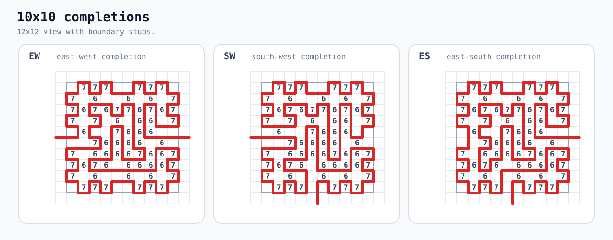
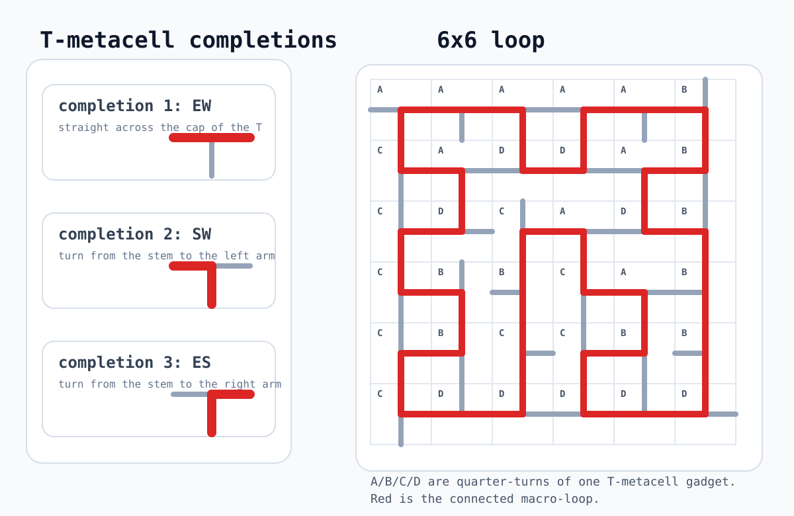
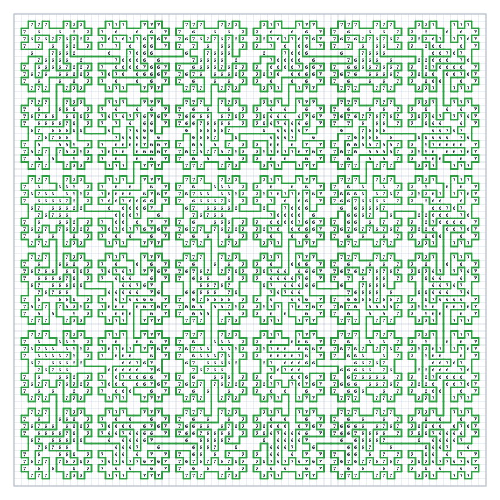

# Moore 6s and 7s

This puzzle is a 67x67 Moore Slitherlink variant. It's visually obvious that there's a 6x6 "macro" grid composed of 10x10 smaller grids.

A closer inspection reveals that there are only four unique 10x10 grids, and in fact they are just rotations of each other so there's really only one. This is a T-metacell with three possible solutions:



In other words, one side is blocked, and two of the remaining three sides can be joined. This reduces the macro grid into a 6x6 simple loop puzzle:



For completeness, here is the full solved 67x67 board:



You can write a script to draw the loop for you. Essentially it'll be something like this:

```
"5 2,9 2,15 2,19 2,27 2,31 2,37 2,41 2,49 2,53 2,59 2,63 2,71 2,75 2,81 2,85 2,93 2,97 2,103 2,107 2,115 2,119 2,125 2,129 2,3 4,7 4,11 4,13 4,17 4,21 4,25 4,29 4,33 4,35 4,39 4,43 4,47 4,51 4,55 4,57 4,61 4,65 4,69 4,73 4,77 4,79 4,83 4,87 4,91 4,95 4,99 4,101 4,105 4,109 4,113 4,117 4,121 4,127 4,131 4,3 6,7 6,9 6,13 6,17 6,21 6,25 6,29 6,31 6,35 6,39 6,43 6,47 6,51 6,53 6,57 6,61 6,65 6,69 6,73 6,75 6,79 6,83 6,87 6,91 6,95 6,97 6,101 6,105 6,109 6,113 6,117 6,119 6,127 6,131 6,3 8,7 8,11 8,21 8,25 8,29 8,33 8,43 8,47 8,51 8,55 8,65 8,69 8,73 8,77 8,87 8,91 8,95 8,99 8,109 8,113 8,117 8,121 8,125 8,131 8,3 10,5 10,7 10,11 10,19 10,21 10,25 10,27 10,29 10,33 10,41 10,43 10,47 10,51 10,55 10,65 10,69 10,71 10,73 10,77 10,85 10,87 10,91 10,93 10,95 10,99 10,107 10,109 10,113 10,115 10,119 10,121 10,123 10,127 10,131 10,5 12,7 12,17 12,19 12,21 12,23 12,25 12,27 12,29 12,39 12,41 12,43 12,45 12,47 12,51 12,63 12,71 12,73 12,83 12,85 12,87 12,89 12,91 12,93 12,95 12,105 12,107 12,109 12,111 12,113 12,119 12,121 12,123 12,127 12,3 14,7 14,15 14,19 14,21 14,25 14,27 14,29 14,37 14,41 14,43 14,47 14,49 14,51 14,63 14,65 14,69 14,73 14,81 14,85 14,87 14,91 14,93 14,95 14,103 14,107 14,109 14,113 14,121 14,123 14,125 14,127 14,131 14,3 16,9 16,13 16,15 16,21 16,25 16,29 16,31 16,35 16,37 16,43 16,47 16,51 16,53 16,59 16,65 16,69 16,75 16,79 16,81 16,87 16,91 16,95 16,97 16,101 16,103 16,109 16,113 16,119 16,123 16,125 16,127 16,131 16,3 18,7 18,11 18,13 18,15 18,17 18,21 18,25 18,29 18,31 18,33 18,35 18,37 18,39 18,43 18,47 18,51 18,53 18,57 18,59 18,61 18,65 18,69 18,73 18,77 18,79 18,81 18,83 18,87 18,91 18,95 18,97 18,99 18,101 18,103 18,105 18,109 18,113 18,117 18,119 18,125 18,127 18,131 18,3 20,7 20,13 20,17 20,21 20,25 20,29 20,33 20,35 20,39 20,43 20,47 20,51 20,57 20,61 20,65 20,69 20,73 20,79 20,83 20,87 20,91 20,95 20,99 20,101 20,105 20,109 20,113 20,117 20,127 20,131 20,5 22,9 22,15 22,19 22,27 22,31 22,37 22,41 22,49 22,53 22,59 22,63 22,71 22,75 22,81 22,85 22,93 22,97 22,103 22,107 22,115 22,119 22,125 22,129 22,5 24,9 24,15 24,19 24,27 24,31 24,37 24,41 24,49 24,53 24,59 24,63 24,71 24,75 24,81 24,85 24,93 24,97 24,103 24,107 24,115 24,119 24,125 24,129 24,3 26,7 26,17 26,21 26,25 26,29 26,33 26,35 26,39 26,43 26,47 26,51 26,55 26,61 26,65 26,69 26,73 26,77 26,83 26,87 26,91 26,95 26,99 26,101 26,105 26,109 26,113 26,117 26,123 26,127 26,131 26,3 28,7 28,9 28,15 28,17 28,21 28,25 28,29 28,31 28,35 28,39 28,43 28,47 28,51 28,53 28,55 28,59 28,61 28,65 28,69 28,73 28,75 28,77 28,79 28,83 28,87 28,91 28,95 28,97 28,101 28,105 28,109 28,113 28,117 28,123 28,127 28,131 28,3 30,7 30,9 30,11 30,15 30,21 30,25 30,29 30,33 30,43 30,47 30,53 30,59 30,61 30,65 30,69 30,75 30,77 30,81 30,87 30,91 30,95 30,99 30,109 30,113 30,121 30,125 30,131 30,3 32,7 32,9 32,11 32,13 32,21 32,25 32,29 32,33 32,43 32,47 32,49 32,61 32,63 32,65 32,69 32,71 32,75 32,83 32,87 32,91 32,93 32,95 32,99 32,107 32,109 32,113 32,115 32,119 32,121 32,123 32,127 32,131 32,7 34,11 34,13 34,15 34,21 34,23 34,25 34,29 34,41 34,49 34,61 34,65 34,67 34,69 34,71 34,73 34,83 34,85 34,93 34,95 34,105 34,107 34,109 34,111 34,113 34,117 34,119 34,121 34,123 34,127 34,3 36,7 36,11 36,13 36,15 36,19 36,21 36,25 36,27 36,29 36,41 36,43 36,47 36,57 36,61 36,65 36,69 36,71 36,79 36,83 36,85 36,87 36,91 36,95 36,103 36,107 36,109 36,113 36,119 36,121 36,123 36,125 36,127 36,131 36,3 38,9 38,13 38,17 38,21 38,25 38,29 38,31 38,37 38,43 38,47 38,57 38,61 38,65 38,69 38,79 38,83 38,87 38,91 38,97 38,101 38,103 38,109 38,113 38,119 38,121 38,123 38,125 38,127 38,131 38,3 40,7 40,15 40,17 40,21 40,25 40,29 40,31 40,35 40,37 40,39 40,43 40,47 40,51 40,55 40,59 40,61 40,65 40,69 40,73 40,77 40,81 40,83 40,87 40,91 40,95 40,99 40,101 40,103 40,105 40,109 40,113 40,117 40,119 40,123 40,125 40,127 40,131 40,3 42,7 42,13 42,17 42,21 42,25 42,29 42,35 42,39 42,43 42,47 42,51 42,55 42,57 42,61 42,65 42,69 42,73 42,77 42,79 42,83 42,87 42,91 42,95 42,101 42,105 42,109 42,113 42,117 42,123 42,127 42,131 42,5 44,9 44,15 44,19 44,27 44,31 44,37 44,41 44,49 44,53 44,59 44,63 44,71 44,75 44,81 44,85 44,93 44,97 44,103 44,107 44,115 44,119 44,125 44,129 44,5 46,9 46,15 46,19 46,27 46,31 46,37 46,41 46,49 46,53 46,59 46,63 46,71 46,75 46,81 46,85 46,93 46,97 46,103 46,107 46,115 46,119 46,125 46,129 46,3 48,7 48,11 48,17 48,21 48,25 48,29 48,33 48,39 48,43 48,47 48,51 48,55 48,61 48,65 48,69 48,73 48,77 48,79 48,83 48,87 48,91 48,95 48,99 48,105 48,109 48,113 48,117 48,121 48,127 48,131 48,3 50,7 50,9 50,11 50,15 50,17 50,21 50,25 50,29 50,31 50,33 50,35 50,39 50,43 50,47 50,51 50,53 50,55 50,59 50,61 50,65 50,69 50,73 50,75 50,79 50,83 50,87 50,91 50,95 50,97 50,99 50,103 50,105 50,109 50,113 50,117 50,119 50,127 50,131 50,3 52,7 52,9 52,11 52,13 52,15 52,21 52,25 52,31 52,33 52,37 52,43 52,47 52,51 52,53 52,55 52,57 52,59 52,65 52,69 52,73 52,77 52,87 52,91 52,97 52,103 52,105 52,109 52,113 52,117 52,121 52,125 52,131 52,3 54,7 54,9 54,11 54,13 54,15 54,21 54,25 54,27 54,31 54,39 54,43 54,47 54,51 54,53 54,55 54,57 54,59 54,65 54,69 54,73 54,77 54,87 54,91 54,93 54,105 54,107 54,109 54,113 54,115 54,119 54,121 54,123 54,127 54,131 54,7 56,11 56,13 56,15 56,17 56,21 56,23 56,25 56,27 56,29 56,39 56,41 56,51 56,55 56,57 56,59 56,61 56,65 56,67 56,69 56,73 56,85 56,93 56,105 56,109 56,111 56,113 56,119 56,121 56,123 56,127 56,3 58,7 58,11 58,13 58,15 58,19 58,21 58,25 58,27 58,35 58,39 58,41 58,43 58,47 58,51 58,55 58,57 58,59 58,63 58,65 58,69 58,71 58,73 58,85 58,87 58,91 58,101 58,105 58,109 58,113 58,121 58,123 58,125 58,127 58,131 58,3 60,9 60,13 60,21 60,25 60,35 60,39 60,43 60,47 60,53 60,57 60,65 60,69 60,73 60,75 60,81 60,87 60,91 60,101 60,105 60,109 60,113 60,119 60,123 60,125 60,127 60,131 60,3 62,7 62,11 62,17 62,21 62,25 62,29 62,33 62,37 62,39 62,43 62,47 62,51 62,55 62,61 62,65 62,69 62,73 62,75 62,79 62,81 62,83 62,87 62,91 62,95 62,99 62,103 62,105 62,109 62,113 62,117 62,119 62,125 62,127 62,131 62,3 64,7 64,11 64,17 64,21 64,25 64,29 64,33 64,35 64,39 64,43 64,47 64,51 64,55 64,61 64,65 64,69 64,73 64,79 64,83 64,87 64,91 64,95 64,99 64,101 64,105 64,109 64,113 64,117 64,127 64,131 64,5 66,9 66,15 66,19 66,27 66,31 66,37 66,41 66,49 66,53 66,59 66,63 66,71 66,75 66,81 66,85 66,93 66,97 66,103 66,107 66,115 66,119 66,125 66,129 66,5 68,9 68,15 68,19 68,27 68,31 68,37 68,41 68,49 68,53 68,59 68,63 68,71 68,75 68,81 68,85 68,93 68,97 68,103 68,107 68,115 68,119 68,125 68,129 68,3 70,7 70,17 70,21 70,25 70,29 70,33 70,39 70,43 70,47 70,51 70,61 70,65 70,69 70,73 70,83 70,87 70,91 70,95 70,99 70,101 70,105 70,109 70,113 70,117 70,127 70,131 70,3 72,7 72,9 72,15 72,17 72,21 72,25 72,29 72,31 72,39 72,43 72,47 72,51 72,61 72,65 72,69 72,73 72,75 72,81 72,83 72,87 72,91 72,95 72,97 72,101 72,105 72,109 72,113 72,117 72,127 72,131 72,3 74,7 74,9 74,11 74,15 74,21 74,25 74,29 74,33 74,37 74,43 74,47 74,55 74,59 74,65 74,69 74,73 74,75 74,77 74,81 74,87 74,91 74,95 74,99 74,109 74,113 74,121 74,125 74,131 74,3 76,7 76,9 76,11 76,13 76,21 76,25 76,27 76,31 76,33 76,35 76,39 76,43 76,47 76,53 76,55 76,57 76,61 76,65 76,69 76,73 76,75 76,77 76,79 76,87 76,91 76,95 76,99 76,109 76,113 76,119 76,121 76,123 76,127 76,131 76,7 78,11 78,13 78,15 78,21 78,23 78,25 78,31 78,33 78,35 78,39 78,53 78,55 78,57 78,61 78,73 78,77 78,79 78,81 78,87 78,89 78,91 78,95 78,107 78,119 78,121 78,123 78,127 78,3 80,7 80,11 80,13 80,15 80,19 80,21 80,25 80,33 80,35 80,37 80,39 80,43 80,47 80,55 80,57 80,59 80,61 80,65 80,69 80,73 80,77 80,79 80,81 80,85 80,87 80,91 80,93 80,95 80,107 80,109 80,113 80,121 80,123 80,125 80,127 80,131 80,3 82,9 82,13 82,17 82,21 82,25 82,31 82,35 82,37 82,39 82,43 82,47 82,53 82,57 82,59 82,61 82,65 82,69 82,75 82,79 82,83 82,87 82,91 82,95 82,97 82,103 82,109 82,113 82,119 82,123 82,125 82,127 82,131 82,3 84,7 84,15 84,17 84,21 84,25 84,29 84,31 84,37 84,39 84,43 84,47 84,51 84,53 84,59 84,61 84,65 84,69 84,73 84,81 84,83 84,87 84,91 84,95 84,97 84,101 84,103 84,105 84,109 84,113 84,117 84,119 84,125 84,127 84,131 84,3 86,7 86,13 86,17 86,21 86,25 86,29 86,39 86,43 86,47 86,51 86,61 86,65 86,69 86,73 86,79 86,83 86,87 86,91 86,95 86,101 86,105 86,109 86,113 86,117 86,127 86,131 86,5 88,9 88,15 88,19 88,27 88,31 88,37 88,41 88,49 88,53 88,59 88,63 88,71 88,75 88,81 88,85 88,93 88,97 88,103 88,107 88,115 88,119 88,125 88,129 88,5 90,9 90,15 90,19 90,27 90,31 90,37 90,41 90,49 90,53 90,59 90,63 90,71 90,75 90,81 90,85 90,93 90,97 90,103 90,107 90,115 90,119 90,125 90,129 90,3 92,7 92,11 92,17 92,21 92,25 92,29 92,35 92,39 92,43 92,47 92,51 92,61 92,65 92,69 92,73 92,77 92,83 92,87 92,91 92,95 92,101 92,105 92,109 92,113 92,117 92,127 92,131 92,3 94,7 94,9 94,11 94,15 94,17 94,21 94,25 94,29 94,35 94,39 94,43 94,47 94,51 94,53 94,59 94,61 94,65 94,69 94,73 94,75 94,77 94,81 94,83 94,87 94,91 94,95 94,101 94,105 94,109 94,113 94,117 94,127 94,131 94,3 96,7 96,9 96,11 96,13 96,15 96,21 96,25 96,33 96,37 96,43 96,47 96,51 96,53 96,55 96,59 96,65 96,69 96,73 96,75 96,77 96,79 96,81 96,87 96,91 96,99 96,103 96,109 96,113 96,121 96,125 96,131 96,3 98,7 98,9 98,11 98,13 98,15 98,21 98,25 98,27 98,31 98,33 98,35 98,39 98,43 98,47 98,51 98,53 98,55 98,57 98,65 98,69 98,73 98,75 98,77 98,79 98,81 98,87 98,91 98,93 98,97 98,99 98,101 98,105 98,109 98,113 98,119 98,121 98,123 98,127 98,131 98,7 100,11 100,13 100,15 100,17 100,21 100,23 100,25 100,29 100,31 100,33 100,35 100,39 100,51 100,55 100,57 100,59 100,73 100,77 100,79 100,81 100,83 100,87 100,89 100,91 100,95 100,97 100,99 100,101 100,105 100,119 100,121 100,123 100,127 100,3 102,7 102,11 102,13 102,15 102,19 102,21 102,25 102,31 102,33 102,35 102,37 102,39 102,43 102,47 102,51 102,55 102,57 102,59 102,65 102,69 102,73 102,77 102,79 102,81 102,85 102,87 102,91 102,97 102,99 102,101 102,103 102,105 102,109 102,113 102,121 102,123 102,125 102,127 102,131 102,3 104,9 104,13 104,21 104,25 104,31 104,33 104,35 104,37 104,39 104,43 104,47 104,53 104,57 104,65 104,69 104,75 104,79 104,87 104,91 104,97 104,99 104,101 104,103 104,105 104,109 104,113 104,119 104,123 104,125 104,127 104,131 104,3 106,7 106,11 106,17 106,21 106,25 106,29 106,31 106,35 106,37 106,39 106,43 106,47 106,51 106,61 106,65 106,69 106,73 106,77 106,83 106,87 106,91 106,95 106,97 106,101 106,103 106,105 106,109 106,113 106,117 106,119 106,125 106,127 106,131 106,3 108,7 108,11 108,17 108,21 108,25 108,29 108,35 108,39 108,43 108,47 108,51 108,61 108,65 108,69 108,73 108,77 108,83 108,87 108,91 108,95 108,101 108,105 108,109 108,113 108,117 108,127 108,131 108,5 110,9 110,15 110,19 110,27 110,31 110,37 110,41 110,49 110,53 110,59 110,63 110,71 110,75 110,81 110,85 110,93 110,97 110,103 110,107 110,115 110,119 110,125 110,129 110,5 112,9 112,15 112,19 112,27 112,31 112,37 112,41 112,49 112,53 112,59 112,63 112,71 112,75 112,81 112,85 112,93 112,97 112,103 112,107 112,115 112,119 112,125 112,129 112,3 114,7 114,17 114,21 114,25 114,29 114,33 114,35 114,39 114,43 114,47 114,51 114,55 114,61 114,65 114,69 114,73 114,77 114,83 114,87 114,91 114,95 114,99 114,101 114,105 114,109 114,113 114,117 114,121 114,127 114,131 114,3 116,7 116,9 116,15 116,17 116,21 116,25 116,29 116,31 116,33 116,35 116,37 116,39 116,43 116,47 116,51 116,53 116,55 116,57 116,61 116,65 116,69 116,73 116,75 116,77 116,81 116,83 116,87 116,91 116,95 116,97 116,99 116,101 116,103 116,105 116,109 116,113 116,117 116,119 116,121 116,123 116,127 116,131 116,3 118,7 118,9 118,11 118,15 118,21 118,25 118,31 118,33 118,37 118,39 118,43 118,47 118,53 118,55 118,59 118,65 118,69 118,75 118,81 118,83 118,87 118,91 118,97 118,99 118,103 118,105 118,109 118,113 118,119 118,121 118,125 118,131 118,3 120,7 120,9 120,11 120,13 120,21 120,25 120,27 120,31 120,39 120,41 120,43 120,47 120,49 120,53 120,61 120,65 120,69 120,71 120,83 120,85 120,87 120,91 120,93 120,97 120,105 120,107 120,109 120,113 120,115 120,119 120,127 120,131 120,7 122,11 122,13 122,15 122,21 122,23 122,25 122,27 122,29 122,39 122,41 122,43 122,45 122,47 122,49 122,51 122,61 122,63 122,71 122,83 122,87 122,89 122,91 122,93 122,95 122,105 122,107 122,109 122,111 122,113 122,115 122,117 122,127 122,129 122,3 124,7 124,11 124,13 124,15 124,19 124,21 124,25 124,27 124,35 124,39 124,41 124,43 124,47 124,49 124,57 124,61 124,63 124,65 124,69 124,79 124,83 124,87 124,91 124,93 124,101 124,105 124,107 124,109 124,113 124,115 124,123 124,127 124,129 124,131 124,3 126,9 126,13 126,17 126,21 126,25 126,35 126,39 126,43 126,47 126,57 126,61 126,65 126,69 126,79 126,83 126,87 126,91 126,101 126,105 126,109 126,113 126,123 126,127 126,131 126,3 128,7 128,15 128,17 128,21 128,25 128,29 128,33 128,37 128,39 128,43 128,47 128,51 128,55 128,59 128,61 128,65 128,69 128,73 128,77 128,81 128,83 128,87 128,91 128,95 128,99 128,103 128,105 128,109 128,113 128,117 128,121 128,125 128,127 128,131 128,3 130,7 130,13 130,17 130,21 130,25 130,29 130,33 130,35 130,39 130,43 130,47 130,51 130,55 130,57 130,61 130,65 130,69 130,73 130,77 130,79 130,83 130,87 130,91 130,95 130,99 130,101 130,105 130,109 130,113 130,117 130,121 130,123 130,127 130,131 130,5 132,9 132,15 132,19 132,27 132,31 132,37 132,41 132,49 132,53 132,59 132,63 132,71 132,75 132,81 132,85 132,93 132,97 132,103 132,107 132,115 132,119 132,125 132,129 132,4 3,6 3,8 3,10 3,14 3,16 3,18 3,20 3,26 3,28 3,30 3,32 3,36 3,38 3,40 3,42 3,48 3,50 3,52 3,54 3,58 3,60 3,62 3,64 3,70 3,72 3,74 3,76 3,80 3,82 3,84 3,86 3,92 3,94 3,96 3,98 3,102 3,104 3,106 3,108 3,114 3,116 3,118 3,120 3,124 3,126 3,128 3,130 3,2 5,22 5,24 5,44 5,46 5,66 5,68 5,88 5,90 5,110 5,112 5,122 5,124 5,132 5,4 7,6 7,10 7,12 7,14 7,16 7,18 7,20 7,26 7,28 7,32 7,34 7,36 7,38 7,40 7,42 7,48 7,50 7,54 7,56 7,58 7,60 7,62 7,64 7,70 7,72 7,76 7,78 7,80 7,82 7,84 7,86 7,92 7,94 7,98 7,100 7,102 7,104 7,106 7,108 7,114 7,116 7,120 7,122 7,124 7,126 7,128 7,130 7,2 9,8 9,14 9,16 9,18 9,22 9,24 9,30 9,36 9,38 9,40 9,44 9,46 9,52 9,58 9,60 9,62 9,66 9,68 9,74 9,80 9,82 9,84 9,88 9,90 9,96 9,102 9,104 9,106 9,110 9,112 9,118 9,128 9,132 9,10 11,12 11,14 11,16 11,32 11,34 11,36 11,38 11,48 11,50 11,54 11,56 11,58 11,60 11,62 11,64 11,76 11,78 11,80 11,82 11,98 11,100 11,102 11,104 11,116 11,124 11,126 11,130 11,4 13,8 13,10 13,12 13,14 13,30 13,32 13,34 13,36 13,52 13,54 13,56 13,58 13,60 13,70 13,74 13,76 13,78 13,80 13,96 13,98 13,100 13,102 13,114 13,116 13,118 13,128 13,130 13,2 15,6 15,10 15,12 15,16 15,18 15,22 15,24 15,32 15,34 15,38 15,40 15,44 15,46 15,54 15,56 15,58 15,60 15,62 15,66 15,68 15,72 15,76 15,78 15,82 15,84 15,88 15,90 15,98 15,100 15,104 15,106 15,110 15,112 15,116 15,118 15,120 15,132 15,4 17,6 17,8 17,18 17,20 17,26 17,28 17,40 17,42 17,48 17,50 17,56 17,62 17,64 17,70 17,72 17,74 17,84 17,86 17,92 17,94 17,106 17,108 17,114 17,116 17,122 17,128 17,130 17,2 19,10 19,22 19,24 19,44 19,46 19,54 19,66 19,68 19,76 19,88 19,90 19,110 19,112 19,120 19,122 19,124 19,132 19,4 21,6 21,8 21,10 21,12 21,14 21,16 21,18 21,20 21,26 21,28 21,30 21,32 21,36 21,38 21,40 21,42 21,48 21,50 21,52 21,54 21,56 21,58 21,60 21,62 21,64 21,70 21,72 21,74 21,76 21,78 21,80 21,82 21,84 21,86 21,92 21,94 21,96 21,98 21,102 21,104 21,106 21,108 21,114 21,116 21,118 21,120 21,122 21,124 21,126 21,128 21,130 21,12 23,56 23,78 23,122 23,4 25,6 25,8 25,10 25,12 25,14 25,16 25,18 25,20 25,26 25,28 25,30 25,32 25,36 25,38 25,40 25,42 25,48 25,50 25,52 25,54 25,56 25,58 25,60 25,62 25,64 25,70 25,72 25,74 25,76 25,78 25,80 25,82 25,84 25,86 25,92 25,94 25,96 25,98 25,102 25,104 25,106 25,108 25,114 25,116 25,118 25,120 25,122 25,124 25,126 25,128 25,130 25,2 27,10 27,12 27,14 27,22 27,24 27,44 27,46 27,58 27,66 27,68 27,80 27,88 27,90 27,110 27,112 27,120 27,132 27,4 29,6 29,12 29,18 29,20 29,26 29,28 29,32 29,34 29,36 29,38 29,40 29,42 29,48 29,50 29,56 29,62 29,64 29,70 29,72 29,82 29,84 29,86 29,92 29,94 29,98 29,100 29,102 29,104 29,106 29,108 29,114 29,116 29,118 29,120 29,122 29,124 29,126 29,128 29,130 29,2 31,14 31,16 31,18 31,22 31,24 31,30 31,36 31,38 31,40 31,44 31,46 31,50 31,52 31,54 31,56 31,58 31,66 31,68 31,72 31,74 31,78 31,80 31,84 31,88 31,90 31,96 31,102 31,104 31,106 31,110 31,112 31,116 31,118 31,128 31,132 31,4 33,6 33,16 33,18 33,20 33,26 33,28 33,32 33,34 33,36 33,38 33,40 33,42 33,52 33,54 33,56 33,58 33,60 33,76 33,78 33,80 33,82 33,86 33,98 33,100 33,102 33,104 33,124 33,126 33,130 33,4 35,8 35,10 35,18 35,30 35,32 35,34 35,36 35,38 35,48 35,50 35,52 35,54 35,56 35,58 35,62 35,64 35,74 35,76 35,78 35,80 35,92 35,96 35,98 35,100 35,102 35,114 35,116 35,128 35,130 35,2 37,6 37,16 37,22 37,24 37,32 37,34 37,36 37,38 37,40 37,44 37,46 37,50 37,52 37,54 37,60 37,66 37,68 37,72 37,74 37,76 37,82 37,88 37,90 37,94 37,98 37,100 37,104 37,106 37,110 37,112 37,116 37,118 37,132 37,4 39,6 39,8 39,10 39,12 39,14 39,18 39,20 39,26 39,28 39,34 39,40 39,42 39,48 39,50 39,52 39,54 39,56 39,58 39,62 39,64 39,70 39,72 39,74 39,76 39,78 39,80 39,84 39,86 39,92 39,94 39,96 39,106 39,108 39,114 39,116 39,128 39,130 39,2 41,10 41,12 41,22 41,24 41,32 41,44 41,46 41,66 41,68 41,88 41,90 41,98 41,110 41,112 41,120 41,122 41,132 41,4 43,6 43,8 43,10 43,14 43,16 43,18 43,20 43,26 43,28 43,30 43,32 43,34 43,36 43,38 43,40 43,42 43,48 43,50 43,52 43,54 43,58 43,60 43,62 43,64 43,70 43,72 43,74 43,76 43,80 43,82 43,84 43,86 43,92 43,94 43,96 43,98 43,100 43,102 43,104 43,106 43,108 43,114 43,116 43,118 43,120 43,124 43,126 43,128 43,130 43,34 45,100 45,4 47,6 47,8 47,10 47,14 47,16 47,18 47,20 47,26 47,28 47,30 47,32 47,34 47,36 47,38 47,40 47,42 47,48 47,50 47,52 47,54 47,58 47,60 47,62 47,64 47,70 47,72 47,74 47,76 47,80 47,82 47,84 47,86 47,92 47,94 47,96 47,98 47,100 47,102 47,104 47,106 47,108 47,114 47,116 47,118 47,120 47,124 47,126 47,128 47,130 47,2 49,12 49,14 49,22 49,24 49,36 49,44 49,46 49,56 49,58 49,66 49,68 49,88 49,90 49,102 49,110 49,112 49,122 49,124 49,132 49,4 51,6 51,18 51,20 51,26 51,28 51,38 51,40 51,42 51,48 51,50 51,62 51,64 51,70 51,72 51,76 51,78 51,80 51,82 51,84 51,86 51,92 51,94 51,100 51,106 51,108 51,114 51,116 51,120 51,122 51,124 51,126 51,128 51,130 51,2 53,16 53,18 53,22 53,24 53,28 53,30 53,34 53,36 53,40 53,44 53,46 53,60 53,62 53,66 53,68 53,74 53,80 53,82 53,84 53,88 53,90 53,94 53,96 53,98 53,100 53,102 53,110 53,112 53,118 53,128 53,132 53,4 55,6 55,18 55,20 55,32 55,34 55,36 55,38 55,42 55,48 55,50 55,62 55,64 55,70 55,72 55,76 55,78 55,80 55,82 55,84 55,86 55,96 55,98 55,100 55,102 55,104 55,116 55,124 55,126 55,130 55,4 57,8 57,10 57,30 57,32 57,34 57,36 57,48 57,52 57,54 57,74 57,76 57,78 57,80 57,82 57,92 57,94 57,96 57,98 57,100 57,102 57,106 57,108 57,114 57,116 57,118 57,128 57,130 57,2 59,6 59,16 59,18 59,22 59,24 59,28 59,30 59,32 59,38 59,44 59,46 59,50 59,60 59,62 59,66 59,68 59,76 59,78 59,80 59,82 59,84 59,88 59,90 59,94 59,96 59,98 59,104 59,110 59,112 59,116 59,118 59,120 59,132 59,4 61,6 61,8 61,10 61,12 61,14 61,16 61,18 61,20 61,26 61,28 61,30 61,32 61,34 61,36 61,40 61,42 61,48 61,50 61,52 61,54 61,56 61,58 61,60 61,62 61,64 61,70 61,72 61,78 61,84 61,86 61,92 61,94 61,96 61,98 61,100 61,102 61,106 61,108 61,114 61,116 61,122 61,128 61,130 61,2 63,14 63,22 63,24 63,44 63,46 63,58 63,66 63,68 63,76 63,88 63,90 63,110 63,112 63,120 63,122 63,124 63,132 63,4 65,6 65,8 65,10 65,12 65,14 65,16 65,18 65,20 65,26 65,28 65,30 65,32 65,36 65,38 65,40 65,42 65,48 65,50 65,52 65,54 65,56 65,58 65,60 65,62 65,64 65,70 65,72 65,74 65,76 65,78 65,80 65,82 65,84 65,86 65,92 65,94 65,96 65,98 65,102 65,104 65,106 65,108 65,114 65,116 65,118 65,120 65,122 65,124 65,126 65,128 65,130 65,12 67,56 67,78 67,122 67,4 69,6 69,8 69,10 69,12 69,14 69,16 69,18 69,20 69,26 69,28 69,30 69,32 69,36 69,38 69,40 69,42 69,48 69,50 69,52 69,54 69,56 69,58 69,60 69,62 69,64 69,70 69,72 69,74 69,76 69,78 69,80 69,82 69,84 69,86 69,92 69,94 69,96 69,98 69,102 69,104 69,106 69,108 69,114 69,116 69,118 69,120 69,122 69,124 69,126 69,128 69,130 69,2 71,10 71,12 71,14 71,22 71,24 71,34 71,36 71,44 71,46 71,54 71,56 71,58 71,66 71,68 71,76 71,78 71,80 71,88 71,90 71,110 71,112 71,120 71,122 71,124 71,132 71,4 73,6 73,12 73,18 73,20 73,26 73,28 73,32 73,34 73,36 73,38 73,40 73,42 73,48 73,50 73,52 73,54 73,56 73,58 73,60 73,62 73,64 73,70 73,72 73,78 73,84 73,86 73,92 73,94 73,98 73,100 73,102 73,104 73,106 73,108 73,114 73,116 73,118 73,120 73,122 73,124 73,126 73,128 73,130 73,2 75,14 75,16 75,18 75,22 75,24 75,30 75,40 75,44 75,46 75,50 75,52 75,62 75,66 75,68 75,80 75,82 75,84 75,88 75,90 75,96 75,102 75,104 75,106 75,110 75,112 75,116 75,118 75,128 75,132 75,4 77,6 77,16 77,18 77,20 77,28 77,36 77,38 77,42 77,48 77,50 77,58 77,60 77,64 77,70 77,72 77,82 77,84 77,86 77,92 77,94 77,98 77,100 77,102 77,104 77,106 77,108 77,114 77,116 77,124 77,126 77,130 77,4 79,8 79,10 79,18 79,26 79,28 79,30 79,40 79,42 79,48 79,50 79,52 79,62 79,64 79,70 79,74 79,76 79,84 79,96 79,98 79,100 79,102 79,104 79,114 79,116 79,118 79,128 79,130 79,2 81,6 81,16 81,22 81,24 81,28 81,30 81,32 81,44 81,46 81,50 81,52 81,54 81,66 81,68 81,72 81,82 81,88 81,90 81,98 81,100 81,102 81,104 81,106 81,110 81,112 81,116 81,118 81,120 81,132 81,4 83,6 83,8 83,10 83,12 83,14 83,18 83,20 83,26 83,28 83,34 83,40 83,42 83,48 83,50 83,56 83,62 83,64 83,70 83,72 83,74 83,76 83,78 83,80 83,84 83,86 83,92 83,94 83,100 83,106 83,108 83,114 83,116 83,122 83,128 83,130 83,2 85,10 85,12 85,22 85,24 85,32 85,34 85,36 85,44 85,46 85,54 85,56 85,58 85,66 85,68 85,76 85,78 85,88 85,90 85,98 85,110 85,112 85,120 85,122 85,124 85,132 85,4 87,6 87,8 87,10 87,14 87,16 87,18 87,20 87,26 87,28 87,30 87,32 87,34 87,36 87,38 87,40 87,42 87,48 87,50 87,52 87,54 87,56 87,58 87,60 87,62 87,64 87,70 87,72 87,74 87,76 87,80 87,82 87,84 87,86 87,92 87,94 87,96 87,98 87,100 87,102 87,104 87,106 87,108 87,114 87,116 87,118 87,120 87,122 87,124 87,126 87,128 87,130 87,34 89,56 89,100 89,122 89,4 91,6 91,8 91,10 91,14 91,16 91,18 91,20 91,26 91,28 91,30 91,32 91,34 91,36 91,38 91,40 91,42 91,48 91,50 91,52 91,54 91,56 91,58 91,60 91,62 91,64 91,70 91,72 91,74 91,76 91,80 91,82 91,84 91,86 91,92 91,94 91,96 91,98 91,100 91,102 91,104 91,106 91,108 91,114 91,116 91,118 91,120 91,122 91,124 91,126 91,128 91,130 91,2 93,12 93,14 93,22 93,24 93,32 93,44 93,46 93,54 93,56 93,58 93,66 93,68 93,78 93,80 93,88 93,90 93,98 93,110 93,112 93,120 93,122 93,124 93,132 93,4 95,6 95,18 95,20 95,26 95,28 95,30 95,32 95,34 95,36 95,38 95,40 95,42 95,48 95,50 95,56 95,62 95,64 95,70 95,72 95,84 95,86 95,92 95,94 95,96 95,98 95,100 95,102 95,104 95,106 95,108 95,114 95,116 95,118 95,120 95,122 95,124 95,126 95,128 95,130 95,2 97,16 97,18 97,22 97,24 97,28 97,30 97,40 97,44 97,46 97,58 97,60 97,62 97,66 97,68 97,82 97,84 97,88 97,90 97,94 97,96 97,106 97,110 97,112 97,116 97,118 97,128 97,132 97,4 99,6 99,18 99,20 99,36 99,38 99,42 99,48 99,50 99,60 99,62 99,64 99,70 99,72 99,84 99,86 99,102 99,104 99,108 99,114 99,116 99,124 99,126 99,130 99,4 101,8 101,10 101,26 101,28 101,40 101,42 101,48 101,52 101,54 101,62 101,64 101,70 101,74 101,76 101,92 101,94 101,106 101,108 101,114 101,116 101,118 101,128 101,130 101,2 103,6 103,16 103,18 103,22 103,24 103,28 103,30 103,44 103,46 103,50 103,60 103,62 103,66 103,68 103,72 103,82 103,84 103,88 103,90 103,94 103,96 103,110 103,112 103,116 103,118 103,120 103,132 103,4 105,6 105,8 105,10 105,12 105,14 105,16 105,18 105,20 105,26 105,28 105,40 105,42 105,48 105,50 105,52 105,54 105,56 105,58 105,60 105,62 105,64 105,70 105,72 105,74 105,76 105,78 105,80 105,82 105,84 105,86 105,92 105,94 105,106 105,108 105,114 105,116 105,122 105,128 105,130 105,2 107,14 107,22 107,24 107,32 107,34 107,44 107,46 107,54 107,56 107,58 107,66 107,68 107,80 107,88 107,90 107,98 107,100 107,110 107,112 107,120 107,122 107,124 107,132 107,4 109,6 109,8 109,10 109,12 109,14 109,16 109,18 109,20 109,26 109,28 109,30 109,32 109,36 109,38 109,40 109,42 109,48 109,50 109,52 109,54 109,56 109,58 109,60 109,62 109,64 109,70 109,72 109,74 109,76 109,78 109,80 109,82 109,84 109,86 109,92 109,94 109,96 109,98 109,102 109,104 109,106 109,108 109,114 109,116 109,118 109,120 109,122 109,124 109,126 109,128 109,130 109,12 111,56 111,78 111,122 111,4 113,6 113,8 113,10 113,12 113,14 113,16 113,18 113,20 113,26 113,28 113,30 113,32 113,36 113,38 113,40 113,42 113,48 113,50 113,52 113,54 113,56 113,58 113,60 113,62 113,64 113,70 113,72 113,74 113,76 113,78 113,80 113,82 113,84 113,86 113,92 113,94 113,96 113,98 113,102 113,104 113,106 113,108 113,114 113,116 113,118 113,120 113,122 113,124 113,126 113,128 113,130 113,2 115,10 115,12 115,14 115,22 115,24 115,44 115,46 115,58 115,66 115,68 115,80 115,88 115,90 115,110 115,112 115,124 115,132 115,4 117,6 117,12 117,18 117,20 117,26 117,28 117,40 117,42 117,48 117,50 117,60 117,62 117,64 117,70 117,72 117,78 117,84 117,86 117,92 117,94 117,106 117,108 117,114 117,116 117,126 117,128 117,130 117,2 119,14 119,16 119,18 119,22 119,24 119,28 119,30 119,34 119,36 119,44 119,46 119,50 119,52 119,56 119,58 119,62 119,66 119,68 119,72 119,74 119,76 119,78 119,80 119,88 119,90 119,94 119,96 119,100 119,102 119,110 119,112 119,116 119,118 119,122 119,124 119,128 119,132 119,4 121,6 121,16 121,18 121,20 121,32 121,34 121,36 121,38 121,54 121,56 121,58 121,60 121,64 121,74 121,76 121,78 121,80 121,82 121,98 121,100 121,102 121,104 121,120 121,122 121,124 121,126 121,130 121,4 123,8 123,10 123,18 123,30 123,32 123,34 123,36 123,52 123,54 123,56 123,58 123,70 123,72 123,74 123,76 123,78 123,80 123,84 123,86 123,96 123,98 123,100 123,102 123,118 123,120 123,122 123,124 123,2 125,6 125,16 125,22 125,24 125,28 125,30 125,32 125,38 125,44 125,46 125,50 125,52 125,54 125,60 125,66 125,68 125,72 125,74 125,76 125,82 125,88 125,90 125,94 125,96 125,98 125,104 125,110 125,112 125,116 125,118 125,120 125,126 125,132 125,4 127,6 127,8 127,10 127,12 127,14 127,18 127,20 127,26 127,28 127,30 127,32 127,34 127,36 127,40 127,42 127,48 127,50 127,52 127,54 127,56 127,58 127,62 127,64 127,70 127,72 127,74 127,76 127,78 127,80 127,84 127,86 127,92 127,94 127,96 127,98 127,100 127,102 127,106 127,108 127,114 127,116 127,118 127,120 127,122 127,124 127,128 127,130 127,2 129,10 129,12 129,22 129,24 129,44 129,46 129,66 129,68 129,88 129,90 129,110 129,112 129,132 129,4 131,6 131,8 131,10 131,14 131,16 131,18 131,20 131,26 131,28 131,30 131,32 131,36 131,38 131,40 131,42 131,48 131,50 131,52 131,54 131,58 131,60 131,62 131,64 131,70 131,72 131,74 131,76 131,80 131,82 131,84 131,86 131,92 131,94 131,96 131,98 131,102 131,104 131,106 131,108 131,114 131,116 131,118 131,120 131,124 131,126 131,128 131,130 131".split(",").forEach(p => {
  const [bx, by] = p.split(" ").map(Number);
  puzzle.board.getb(bx, by).setLine();
});
puzzle.redraw();
checkBtn.click();
```

That prints out the message

```
Correct solution! skbdg{shade_inside_the_loop_you_might_see_a_35_its_snowing_on_mount_fuji}
```
