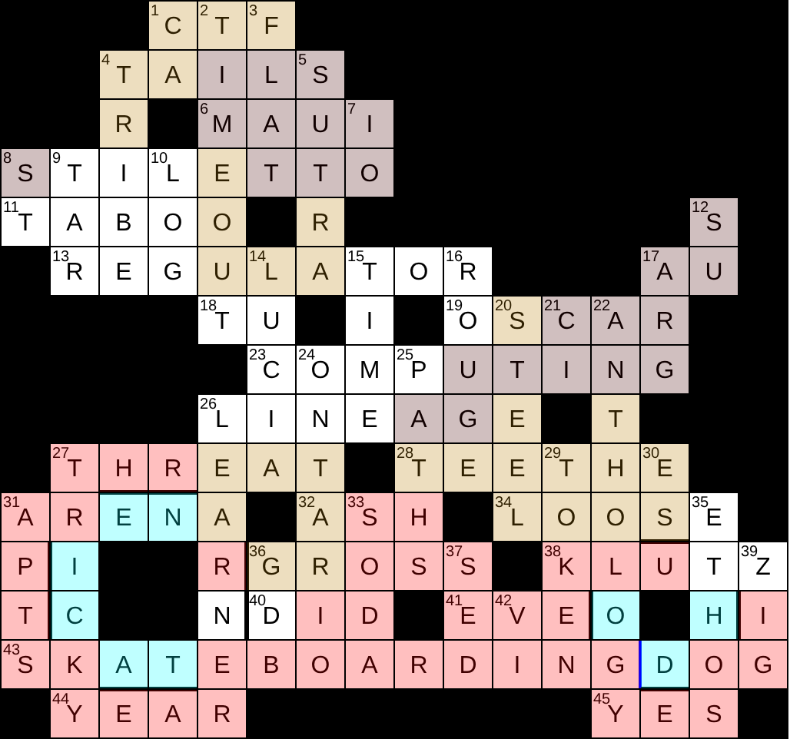

# Skateboarding Dog Cryptic 2026 — Solution



Explanations below. Definitions are <u>underlined</u>.

## Across

- **1A CTF** — Xor-by-one bug at <u>43 Across's event?</u> (3)  
  XOR each ASCII byte of `BUG` with `1`: `B→C`, `U→T`, `G→F`.

- **4A TAILS** — Heard stories of <u>privacy-focused OS</u> (5)  
  Homophone of **tales** (“stories”).

- **6A MAUI** — <u>The Rock plays this</u> <u>.NET frontend framework</u> (4)  
  Double definition: Maui is played by Dwayne “The Rock” Johnson; .NET MAUI is the framework.

- **8A STILETTO** — Street toilet compromised by <u>penetration tool</u> (8)  
  `ST` (“street”) + anagram of `TOILET`.

- **11A TABOO** — <u>Sharing flags, perhaps?</u> Thanks for first, third, and fourth blood! (5)  
  `TA` (“thanks”) + letters 1, 3, 4 of `BLOOD` = `BOO`.

- **13A REGULATOR** — Router lag sorted out with this <u>device</u>? (9)  
  Anagram of `ROUTER LAG`.

- **17A AU** — <u>Gold</u> in <u>Australia</u> (2)  
  Double definition/abbreviation: chemical symbol for gold; abbreviation for Australia.

- **18A TU** — Not even true for <u>you in Paris</u> (2)  
  Odd-positioned letters of `TrUe`.

- **19A OSCAR** — <u>O on the radio</u>, maybe Android Auto? (5)  
  `OS` (Android) + `CAR` (auto); **Oscar** is NATO phonetic alphabet for O.

- **23A COMPUTING** — <u>Processing</u> incoming HTTP request? (9)  
  `PUT` (HTTP method) inside `COMING` (“incoming”): `COM(PUT)ING`.

- **26A LINEAGE** — <u>Ancestry</u> could be a clue for eagle? (7)  
  Playful reverse-wordplay: `L IN EAGE` could be intepreted as a clue for `EAG(L)E`.

- **27A THREAT** — Mad Hatter's <u>security concern</u> (6)  
  Anagram of `HATTER`.

- **28A TEETHE** — <u>Grow canines</u> in remote Ethernet (6)  
  Hidden across remo**te Ethe**rnet.

- **31A ARENA** — Malware naturally conceals <u>glibc heap region</u> (5)  
  Hidden in malw**ARE NA**turally.

- **32A ASH** — See 33 Down.  
  The second half of **SODA ASH**; see **33D**.

- **34A LOOSE** — <u>Insecure</u> toilet gets social engineering (5)  
  `LOO` (toilet) + `SE` (social engineering).

- **36A GROSS** — <u>Disgusting</u> backdoor in forefront of Google's open-source software (5)  
  `G` (forefront of `Google's`) + `R` (back of `dooR`) + `OSS` (open-source software).

- **38A KLUTZ** — Heads of Kali Linux used their zeroday on <u>clumsy operator</u> (5)  
  Initial letters of **K**ali **L**inux **U**sed **T**heir **Z**eroday.

- **40A DID** — <u>Carried out</u> ROT14 on pup? (3)  
  `PUP` under ROT14 becomes `DID`.

- **41A EVE** — Cleverly camouflaged <u>woman spying on Alice and Bob</u> (3)  
  Hidden in cl**EVE**rly; Eve is the conventional eavesdropper in cryptography.

- **43A SKATEBOARDING DOG** — <u>Go-kart-based dingo on different wheels?</u> (13,3)  
  &lit: anagram of `GO KART BASED DINGO`, indicated by "on different wheels"; the whole clue whimsically describes the result.

- **44A YEAR** — Memory leakage via browser ends in <u>middle part of a CVE</u> (4)  
  End letters of memor**Y** leakag**E** vi**A** browse**R**; a CVE identifier has the year in the middle, e.g. `CVE-2026-…`.

- **45A YES** — <u>Your exploit succeeds initially!</u> (3)  
  Initial letters of **Y**our **E**xploit **S**ucceeds; the whole clue also gives the affirmative “YES!”.

## Down

- **1D CA** — Bit of scam... <u>maybe let's encrypt?</u> (2)  
  Hidden in s**CA**m; Let's Encrypt is a certificate authority (CA).

- **2D TIMEOUT** — See 7 Down.  
  The second half of **IO TIMEOUT**; see **7D**.

- **3D FLAT** — <u>Dull</u> exploit finally completes partial flag (4)  
  `FLA` (partial `FLAG`) + final letter of `exploiT`.

- **4D TRIBE** — <u>Apache, maybe</u> Tribune, unless...? (5)  
  `TRIBUNE` **UN-less**: remove `UN` to get `TRIBE`.

- **5D SUTRA** — <u>Buddhist scripture</u>'s reversing arts cracked by university (5)  
  Reverse `ARTS` → `STRA`, then insert `U` (university) → `SUTRA`.

- **7D, 2D IO TIMEOUT** — <u>Error waiting on recv</u> when Jupiter's moon takes a break? (2,7)  
  `IO` (Jupiter's moon) + `TIME OUT` (“takes a break”).

- **8D, 14D ST LUCIA** — Rioting lunatics take down primary node on <u>Caribbean island</u> (2,5)  
  Anagram of `LUNATICS` minus the first (“primary”) letter of `Node`, i.e. `N`.

- **9D TAR** — 24 Down's kernel <u>archiver</u>? (3)  
  The middle three letters (“kernel”) of `ONTARIO` are `TAR`.

- **10D, 15D LOG TIME** — <u>When trees are cut</u> <u>efficiently, e.g. by repeated halving?</u> (3,4)  
  Cryptic double definition/pun: tree-cutting gives “log time”; repeated halving is logarithmic time (efficient).

- **12D SU** — Elevate us to <u>become root with this command</u> (2)  
  Reverse `US` (“elevate” in a Down clue) → `SU`.

- **14D LUCIA** — See 8 Down.  
  The second half of **ST LUCIA**.

- **15D TIME** — See 10 Down.  
  The second half of **LOG TIME**.

- **16D ROUGE** — <u>Cosmetic</u> rogue has internal bytes swapped (5)  
  `ROGUE` with the internal `G` and `U` swapped.

- **17D ARG** — <u>Function parameter</u> at prime positions in garage (3)  
  Positions 2, 3, and 5 of `gARaGe` give `ARG`.

- **20D STEEL** — <u>Show resolve</u> when leetspeaking? (5)  
  `LEETS` peaking (going upwards in a down clue) → `STEEL`.

- **21D CI** — <u>Pipeline Automation</u> <u>101</u> (2)  
  Double definition: CI (continuous integration) automates pipelines; `CI` is 101 in Roman numerals.

- **22D ANTHOLOGY** — Headless Python hacked with goal of <u>compilation</u>? (9)  
  Remove the head of `PYTHON` → `YTHON`, then anagram `YTHON + GOAL`.

- **24D ONTARIO** — Rings about train at sixes and sevens in <u>Canadian province</u> (7)  
  Two `O`s (“rings”) around an anagram of `TRAIN`: `O + NTARI + O`.

- **25D PATHS** — Plan to host uneven <u>targets of traversal attacks</u> (5)  
  Odd-positioned (“uneven”) letters of `PlAn To HoSt`.

- **26D LEARNER** — Clear nerd coming out of shell <u>might be new to CTFs?</u> (7)  
  Strip the outer letters (“shell”) from `cLEAR NERd`.

- **27D TRICKY** — <u>Like a 43 Across's routine or a nasty CTF challenge?</u> (6)  
  Double definition: a skateboarding dog does tricks so its routine is *trick-y*, and a nasty CTF challenge can be tricky.

- **29D TOKEN** — <u>Unit consumed by AI</u> in crypto kennel (5)  
  Hidden across cryp**to ken**nel.

- **30D ES** — <u>Spanish is</u> <u>standard for JavaScript language</u> (2)  
  Double definition: `es` is the Spanish word for "is"; ES = ECMAScript.

- **31D APTS** — <u>State-sponsored hackers</u> with troubled past (4)  
  Anagram of `PAST` → `APTS` (APTs = advanced persistent threats).

- **33D, 32A SODA ASH** — Denial-of-service returns a headerless hash: <u>Na2CO3</u> (4,3)  
  Reverse `DOS` → `SOD`, then add `A` → `SODA`; remove the header of `[h]ASH` → `ASH`.

- **35D ETHOS** — Those rotating right for <u>hacker culture</u>? (5)  
  Rotate `THOSE` one place to the right → `ETHOS`.

- **36D GDB** — Debug odd glitches with <u>this tool</u>? (3)  
  Odd-positioned letters of `DeBuG` give `DBG`; “glitches” rearranges them to `GDB`.

- **37D SED** — <u>First stream editor?</u> (3)  
  &lit: first letter of `Stream` (`S`) + `ED` (editor) → `SED`, itself the first stream editor.

- **39D ZIG** — <u>Sharp turn</u> for <u>language with comptime</u> (3)  
  Double definition: a **zig** is a sharp turn; Zig is the programming language.

- **42D VI** — Stuck in unforgiving <u>text editor</u>? (2)  
  Hidden in unforgi**vi**ng.

## Flag

Taking the letters in numbered cells 1–45 gives the flag:

```
skbdg{CTFTSMISTLTSRLTRATOSCACOPLTTTEAASLEGSKZDEVSYY}
```
