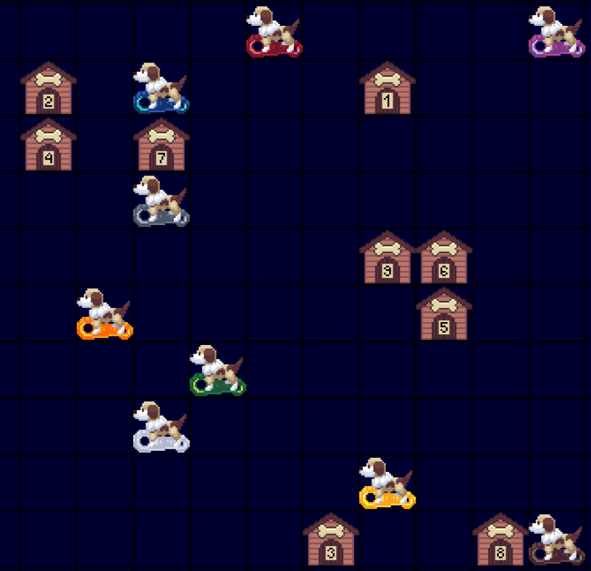

# Trailblazer

Notice the words _resist_ and _colours_ in the challenge description and/or
realise that resistor codes are a reasonable ordering of 9 colours.

This is a [numberlink](https://en.wikipedia.org/wiki/Numberlink) / flow-like
puzzle where each dog should be linked with their matching kennel without
crossing each others' paths. There is only one unique way to do this.

Once you have the trails of the dogs to their kennels, you extract the answer
by taking the lengths of each trail and decoding this with A1Z26 to get the
answer `KENNELING`.
